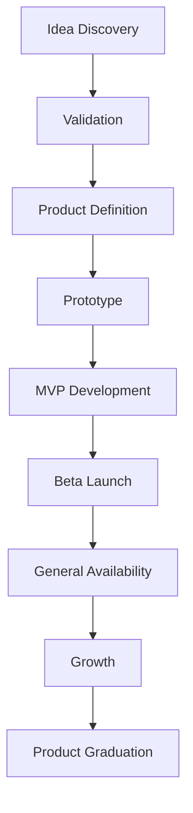

# GV Labs

<p align="center">
  
  
  
  
</p>

<p align="center">
  <strong>Product Innovation & Venture Development Division of Genoventures</strong>
</p>

<p align="center">
  Building software products, intelligent systems, and reusable platforms designed to become enduring assets.
</p>

---

## About GV Labs

**GV Labs** is the dedicated software product innovation division of **Genoventures**.

We discover, design, build, launch, and grow software products that strengthen the Genoventures ecosystem through recurring value, intellectual property, reusable infrastructure, and long-term strategic advantage.

GV Labs is not a traditional engineering department.

It is an internal venture laboratory.

A product foundry.

A systems workshop.

A place where raw ideas get pressure-tested, shaped, shipped, measured, and either scaled into something durable or respectfully sent to the graveyard with useful lessons still attached.

---

## What We Build

GV Labs focuses on software products with commercial, operational, or strategic potential.

```txt
SaaS Platforms
AI-Native Products
Desktop Applications
Mobile Applications
Browser Extensions
APIs & Developer Tools
Productivity Systems
Knowledge Systems
Internal Platforms
Workflow Automation Tools
```

Every product is evaluated by a simple question:

> Can this become a durable asset?

If the answer is no, we either reshape it, reduce it, or kill it before it eats the calendar.

---

## Operating Philosophy

<p align="center">
  
  
  
  
</p>

GV Labs follows one core rhythm:

```txt
Build. Validate. Improve. Scale.
```

We move quickly, but not randomly.

We use AI aggressively, but not blindly.

We build with taste, but measure with discipline.

We favor reusable systems over isolated wins.

We care about shipping, but we care even more about what survives after shipping.

---

## Product Lifecycle

GV Labs products move through a structured venture-development pipeline.



A product may graduate into:

```txt
Independent Brand
Dedicated Business Unit
Portfolio Company
Standalone Venture
Long-Term Genoventures Platform Asset
```

---

## Current Build Bias

GV Labs prefers products that are:

<p align="center">
  
  
  
  
  
</p>

We especially like:

```txt
Small sharp wedges
Operator tools
Workflow systems
AI-assisted utilities
Creator infrastructure
Local-first helpers
Internal tools with commercial upside
Boring products with sneaky leverage
```

We are careful with:

```txt
Overbuilt platforms
Unvalidated “AI wrappers”
Feature soup
Expensive infra fantasies
Products with no distribution path
Anything that requires a 400-page roadmap before the first useful screen exists
```

---

## AI Strategy

AI is foundational at GV Labs, but it has to earn its chair at the table.

We use AI for:

```txt
AI-Assisted Development
Workflow Automation
Natural Language Interfaces
Structured Extraction
Routing & Classification
Retrieval-Augmented Systems
Agentic Workflows
Product Research
Documentation
Decision Support
```

AI should improve the user outcome.

Not decorate the landing page.

Not hallucinate the business model.

Not turn a simple tool into a haunted vending machine.

---

## Core Stack

<p align="center">
  
  
  
  
  
</p>

Primary workflow stack:

```txt
Code editor
Version control platform
AI-assisted coding tools
Cloud-based language models
Conversational AI interfaces
Integrated development environments
Local AI runtimes
Lightweight local language models
Knowledge management systems
Markdown
Modern web tooling
```

The philosophy:

```txt
Deterministic systems first.
Cloud agents for heavy work.
Local SLMs for lightweight language glue.
Human judgment always on top.
```

---

## Product Categories

GV Labs explores products across several active zones.

| Category               | Focus                                            |
| ---------------------- | ------------------------------------------------ |
| Productivity Systems   | Capture, routing, workflows, planning, execution |
| AI-Native Tools        | Assistive agents, local models, smart interfaces |
| Developer Utilities    | Git workflows, repo tooling, automation, docs    |
| Creator Infrastructure | Publishing, scheduling, content ops, media tools |
| Commerce Systems       | Store ops, brand workflows, product management   |
| Knowledge Platforms    | Research, memory, structured notes, retrieval    |
| Internal Platforms     | Reusable systems that may become public products |

---

## Reusable Platform Strategy

Every product should leave behind something useful.

GV Labs prioritizes reusable internal infrastructure such as:

```txt
Authentication
User Management
Billing
Subscriptions
AI Services
Notifications
Analytics
Logging
Monitoring
Design Systems
Component Libraries
Shared APIs
Internal SDKs
Deployment Infrastructure
```

The goal is compounding leverage.

Every product should make the next product faster, cleaner, smarter, or stronger.

---

## Success Metrics

We do not measure success by how busy the lab looks.

We measure by what ships, survives, and compounds.

```txt
Products Launched
Time From Idea to MVP
Active Users
Monthly Recurring Revenue
Customer Retention
User Satisfaction
Feature Adoption
Product Reliability
Experiment Velocity
Reusable Assets Created
Intellectual Property Developed
Operational Knowledge Gained
```

Release frequency matters.

Durable value matters more.

---

## Product Standards

A GV Labs product should be:

```txt
Useful enough to matter
Simple enough to ship
Clear enough to explain
Strong enough to scale
Secure enough to trust
Flexible enough to evolve
Reusable enough to compound
Valuable enough to survive
```

The lab does not worship complexity.

Complexity is a tax.

We pay it only when the product earns it.

---

## Active Operating Model

```txt
Founder-Led
AI-Assisted
Product-Driven
Experiment-Friendly
Launch-Oriented
Evidence-Guided
Long-Term Asset Focused
```

GV Labs is built for practical experimentation.

Ideas are welcome.

Weak assumptions are interrogated.

Useful systems are reused.

Good products are grown.

Bad ideas are thanked for their service and escorted off the premises.

---

## Motto

<p align="center">
  
  
  
</p>

<p align="center">
  <strong>GV Labs builds software products that become assets.</strong>
</p>

<p align="center">
  Built under Genoventures. Built on legacy. Built for what lasts.
</p>
